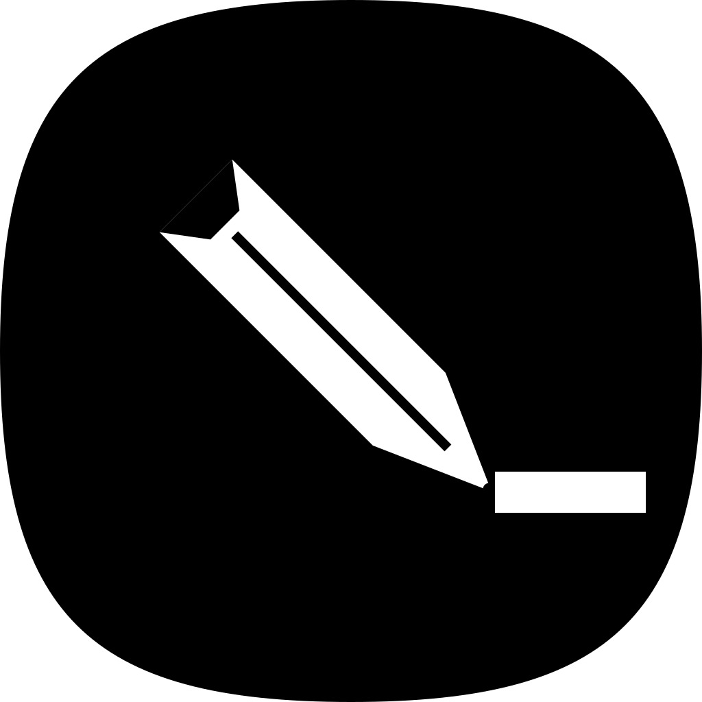

<p align="center">
  
</p>

# draw

**A quiet, local-first sketchpad for the desktop.**

Open the app, draw a thing, close the app. That's the whole loop. No
account, no cloud, no sync spinner — every drawing is just a plain
`.excalidraw` file on your own disk. Autosaved every keystroke. Works
on a plane.

Built on the Excalidraw canvas you already know, wrapped in a native
macOS shell that gets out of the way.

**Project site:** [wolves.ink/projects/draw](https://wolves.ink/projects/draw) ·
**Studio:** [wolves.ink](https://wolves.ink)

---

## Features

- **Local files, real files.** Drawings live in
  `~/Library/Application Support/ink.wolves.draw/drawings/` as plain
  `.excalidraw` JSON. Open them in any Excalidraw client, commit them
  to git, grep them, back them up — they're yours.
- **Continuous autosave with crash recovery.** Every change is flushed
  to disk via atomic `.tmp` → rename. Stale temp files are swept on
  launch. Pull the plug mid-stroke; the file is fine.
- **Offline-first.** No network calls, no telemetry, no login. The
  app does the same thing on a train as it does on a desk.
- **Sidebar file tree.** Folders, nested folders, drag-and-drop to
  reorganize, in-place rename, delete. Resizable, collapsible, and it
  remembers what you had open.
- **Drop to import.** Drag a `.excalidraw` file from Finder onto the
  window — the import flow asks where to put it and detects overwrites.
- **Light & dark.** A single toggle in the topbar. Pure white or pure
  graphite — the canvas matches.
- **Keyboard-first.** `⌘N` new drawing · `⌘⇧N` new folder · `⌘I` import
  · `⌘S` force-save · `⌘⌫` delete · `⌘\` toggle sidebar.
- **Silent auto-update.** Checks for new releases a few seconds after
  launch, signed with the Tauri minisign key. The user always confirms
  the restart — your in-flight canvas is never yanked out from under you.
- **Universal macOS binary.** One signed, notarized `.dmg` runs natively
  on Apple Silicon and Intel.
- **Native iPad app.** Same `.excalidraw` files, same brutalist UI,
  re-flowed for touch. Apple Pencil works (pressure-aware strokes,
  palm rejection). Slide Over and Split View supported on iPad.

---

## Design

Brutalist, on purpose.

- Pure black on pure white (or pure white on graphite, in dark mode).
  No gradients. No frosted glass. No animated mascots.
- Hard 4px offset shadows — the kind printed posters cast — instead of
  soft drop shadows. Everything reads as a placed object.
- Hairline borders at full contrast: black-on-white, white-on-black.
  Borders are structural, not decorative.
- Typography is two faces, doing different jobs. **JetBrains Mono** in
  small caps with wide tracking carries every label, button, kbd hint
  and the active-file title in the topbar — load-bearing monospace.
  **Instrument Sans** keeps the file tree and body content readable.
- Native macOS chrome: traffic lights overlay a single unified topbar
  that doubles as the window drag region. The title in the middle is
  the file you're currently editing.
- An empty canvas shows a faint drafting-dot grid and nothing else.

The whole thing is meant to feel like a clean drafting table, not a SaaS
dashboard.

---

## Local development

```bash
pnpm install
pnpm tauri dev
```

Frontend-only (in a browser) for layout work:

```bash
pnpm dev    # runs vite at http://localhost:1420
```

Note that filesystem features (autosave, file tree, import) only work in
the Tauri shell — the browser-only path will throw on those calls.

---

## iOS / iPad development

`draw` ships as a universal macOS app **and** a native iPad app, sharing
the same React frontend and the same Rust backend. iPad is the primary
mobile target; iPhone is hidden by default (`TARGETED_DEVICE_FAMILY = 2`).

### Prerequisites

- **Xcode 15+** with the iOS SDK and a working `xcrun` toolchain.
  Verify with `xcrun --version`.
- **An Apple ID** signed in to Xcode → Settings → Accounts. The free
  personal team is enough for Simulator and tethered-device dev (with a
  7-day provisioning rotation). A paid Apple Developer Program account
  ($99/yr) is only required for TestFlight / App Store submission.
- **iOS Rust targets** installed:
  ```bash
  rustup target add aarch64-apple-ios aarch64-apple-ios-sim x86_64-apple-ios
  ```
- **`libimobiledevice`** (for tethered iPad builds — `pnpm tauri ios init`
  installs it via Homebrew automatically the first time).

### First-time setup

```bash
pnpm tauri ios init
```

This generates `src-tauri/gen/apple/` (the Xcode project, committed to
git) and writes the iPad-specific Info.plist + project settings. Open the
project once in Xcode to set the Team / signing identity:

```bash
open src-tauri/gen/apple/draw.xcodeproj
```

### Dev loop

Simulator (default: latest iPad Pro):

```bash
pnpm tauri ios dev
```

Tethered iPad over Wi-Fi (the iPad and your Mac must be on the same
network; Xcode must trust the device):

```bash
pnpm tauri ios dev --host
```

The Vite dev server auto-reloads on JS/CSS edits; Rust changes trigger a
Cargo rebuild as part of the Xcode build phase. The macOS desktop dev
loop (`pnpm tauri dev`) is unaffected — you can have both running side
by side.

### Building an `.ipa`

```bash
pnpm tauri ios build
```

Produces an `.ipa` under `src-tauri/gen/apple/build/`. For TestFlight
distribution, archive in Xcode (Product → Archive) and use the Organizer
to upload to App Store Connect. Apple's first-build review for a new
TestFlight app is 1–4 business days — plan accordingly.

### Configuration overview

- **Info.plist:** [`src-tauri/gen/apple/draw_iOS/Info.plist`](./src-tauri/gen/apple/draw_iOS/Info.plist)
  — iPad orientations, Split View / Slide Over, document-folder usage
  description.
- **Capabilities:** [`src-tauri/capabilities/mobile.json`](./src-tauri/capabilities/mobile.json)
  — drops `updater`, `process` and window-drag permissions (App Store
  handles iOS updates; iOS has no draggable window).
- **iOS-only Tauri overlay:** [`src-tauri/tauri.ios.conf.json`](./src-tauri/tauri.ios.conf.json)
  — overrides the macOS window block (no fixed size, no titleBarStyle)
  with mobile-friendly defaults.
- **Min deployment target:** iOS 16.0 — covers >95% of active iPads and
  unlocks `100dvh`, `env(safe-area-inset-*)`, and modern WKWebView fixes.
- **Touch / responsive layout:** Compact viewports (<768px — iPhone, iPad
  Slide Over, half-screen Split View) flip the sidebar to a slide-in
  drawer; wide viewports keep the desktop column. Implementation lives
  in [`src/lib/platform.ts`](./src/lib/platform.ts) +
  [`src/styles/app.css`](./src/styles/app.css) (`.app-shell`,
  `.sidebar-drawer`, `.platform-ios` overrides).

### Trade-offs / known caveats

- The `<meta name="viewport">` declares `user-scalable=no` so iOS's
  pinch-to-zoom-the-page doesn't fight Excalidraw's native pinch-to-zoom-
  the-canvas. This violates WCAG 2.1 1.4.4 (the user can't zoom the UI
  itself). A "Larger text" toggle is a sensible follow-up.
- The auto-updater is desktop-only — iOS apps update through the App
  Store. The `useUpdater` hook is cfg-guarded and silently no-ops on iOS.
- Drawings are sandboxed: each platform keeps its own
  `Application Support/ink.wolves.draw/drawings/` directory. There's no
  cross-device sync. Files.app integration (which would expose drawings
  to AirDrop and iCloud Drive) is deferred — toggle
  `UIFileSharingEnabled` and `LSSupportsOpeningDocumentsInPlace` in the
  Info.plist when ready, and move the data dir to `Documents/`.
- `gen/apple/` is committed to git so CI and teammates always have a
  working Xcode project. Per-user editor state, build outputs, and
  Pods/Externals are gitignored.

---

## Distribution — how to ship a release

Releases are produced by GitHub Actions. The maintainer never builds a
`.dmg` locally for distribution.

### One-time setup (do this once, before the first release)

1. **Add the Apple Developer ID + Tauri updater secrets to GitHub:**
   Settings → Secrets and variables → Actions → *New repository secret*

   | Secret | Value |
   |---|---|
   | `APPLE_CERTIFICATE` | base64 of your Developer ID `.p12` |
   | `APPLE_CERTIFICATE_PASSWORD` | password for that `.p12` |
   | `APPLE_SIGNING_IDENTITY` | `Developer ID Application: Your Name (TEAMID)` |
   | `APPLE_ID` | your Apple ID email |
   | `APPLE_PASSWORD` | app-specific password (created at appleid.apple.com → Sign-In and Security → App-Specific Passwords) |
   | `APPLE_TEAM_ID` | 10-character team id |
   | `TAURI_SIGNING_PRIVATE_KEY` | contents of `.secrets/updater.key` (this file is gitignored — keep your local copy safe) |
   | `TAURI_SIGNING_PRIVATE_KEY_PASSWORD` | blank if generated without password |

   Encoding the `.p12` for `APPLE_CERTIFICATE`:

   ```bash
   base64 -i path/to/DeveloperID.p12 | pbcopy
   ```

2. **Commit `.secrets/updater.key.pub` is NOT needed** — the public key
   is already baked into [`src-tauri/tauri.conf.json`](./src-tauri/tauri.conf.json)
   under `plugins.updater.pubkey`. The signing key in `.secrets/` stays
   local, never in git (see `.gitignore`).

### Cutting a release

Bump the version in **two** places (they must match):

- [`package.json`](./package.json) → `version`
- [`src-tauri/tauri.conf.json`](./src-tauri/tauri.conf.json) → `version`

Then tag and push:

```bash
git commit -am "v0.2.0"
git tag v0.2.0
git push --follow-tags
```

The [`release.yml`](./.github/workflows/release.yml) workflow will:

1. Build a universal `.dmg` (Apple Silicon + Intel in one file)
2. Sign it with your Developer ID + notarize it with Apple
3. Sign the updater payload with the Tauri minisign key
4. Publish a GitHub Release with all artifacts
5. Re-upload the `.dmg` under the stable filename `draw.dmg` so the
   marketing site can link to one URL forever

Total runtime is about 12–18 minutes, mostly Apple notarization.

---

## Distribution URLs (link these from the marketing site)

These URLs are stable forever — they always point at the current latest
release:

| What | URL |
|---|---|
| **Direct DMG download** (use this on your "Download" button) | `https://github.com/wolvesdotink/draw/releases/latest/download/draw.dmg` |
| Updater manifest (the in-app updater hits this) | `https://github.com/wolvesdotink/draw/releases/latest/download/latest.json` |
| Release page (changelog, all assets) | `https://github.com/wolvesdotink/draw/releases/latest` |

GitHub auto-redirects `releases/latest/download/<filename>` to the asset
of that name in the most recent non-prerelease.

Example download button HTML for the website:

```html
<a href="https://github.com/wolvesdotink/draw/releases/latest/download/draw.dmg" download>
  Download for macOS
</a>
```

---

## In-app auto-update

The app checks for updates 4 seconds after launch (silent — no UI flash
on cold-start). When the updater finds a newer version on the manifest
endpoint, the topbar grows a small `↑` button with an accent dot.

| Topbar state | Means |
|---|---|
| (hidden) | Up to date or check still pending |
| `↑` + dot | Update available — click to download + install |
| `[ ## % ]` | Currently downloading / installing |
| `⟲ RESTART` (inverted) | Install complete — click to relaunch |
| `!` (red) | Check or install failed — click to retry |

The updater never auto-restarts the app. The user always confirms by
clicking `RESTART`, so any in-flight canvas state is safe.

Implementation:

- Hook: [`src/hooks/useUpdater.ts`](./src/hooks/useUpdater.ts)
- Button: [`src/components/UpdateButton.tsx`](./src/components/UpdateButton.tsx)
- Plugin config: `plugins.updater` in `tauri.conf.json`

---

## App icon

Two SVG sources, split by whether the target OS applies its own mask:

- [`src-tauri/icons/icon-ios.svg`](./src-tauri/icons/icon-ios.svg) — **iOS** and **macOS Tahoe (26+)**. Full-bleed black square. iOS and modern macOS apply a continuous-curve Liquid Glass mask; a squircle source would double-mask and leak the glass background through the SVG's transparent corners as a grey border.
- [`src-tauri/icons/icon.svg`](./src-tauri/icons/icon.svg) — **Windows** and **Linux** (and historical pre-Tahoe macOS). Big Sur squircle with transparent corners. These platforms don't mask, so the squircle IS the icon shape.

To regenerate the **macOS** app icon (`.icns` + dock/window PNGs) from `icon-ios.svg`:

```bash
bash src-tauri/icons/generate-mac-icons.sh
```

To regenerate the **iOS** app icon PNGs from `icon-ios.svg`:

```bash
bash src-tauri/icons/generate-ios-icons.sh
```

This rasterises every size declared in the iOS appiconset `Contents.json`
into both `src-tauri/icons/ios/` and `src-tauri/gen/apple/Assets.xcassets/AppIcon.appiconset/`.

To regenerate the **Windows / Linux** icon sizes from `icon.svg`:

```bash
rsvg-convert -w 1024 -h 1024 src-tauri/icons/icon.svg -o src-tauri/icons/icon-source.png
pnpm tauri icon src-tauri/icons/icon-source.png
```

Note: `pnpm tauri icon` would also overwrite `icon.icns` and the dock PNGs
with the squircle shape — re-run `generate-mac-icons.sh` afterward to
restore the full-bleed Mac variant. Commit all generated files.

If you don't have `rsvg-convert`:

```bash
brew install librsvg
```

---

## Recommended IDE Setup

- [VS Code](https://code.visualstudio.com/)
- [Tauri](https://marketplace.visualstudio.com/items?itemName=tauri-apps.tauri-vscode)
- [rust-analyzer](https://marketplace.visualstudio.com/items?itemName=rust-lang.rust-analyzer)

---

## Credits

`draw` stands entirely on the shoulders of [**Excalidraw**](https://excalidraw.com)
and the team behind it. The canvas, the hand-drawn aesthetic, the
`.excalidraw` file format, the editing model — all of it is their work.
This app is a thin native shell around their open-source editor, and it
exists only because they built and freely shared something extraordinary.

Huge thanks to the Excalidraw maintainers and contributors for years of
patient, high-quality, MIT-licensed work. If you like what `draw` does,
go support them: [github.com/excalidraw/excalidraw](https://github.com/excalidraw/excalidraw).
